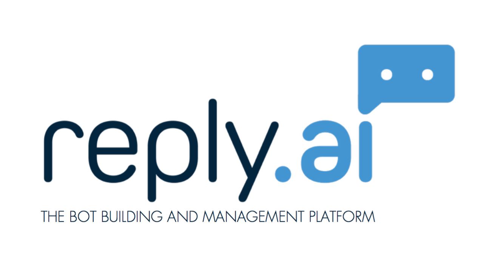

class: center, middle, inverse-title
background-image: url(./images/background1.jpg)
background-repeat: no-repeat
background-position: center

# El Bot autodidacta

---

class: inverse, center

# @javaguirre

[](https://www.reply.ai)


---

class: inverse, center

# Qué es un bot?

* Aplicación automatiza una tarea
* Imita comportamiento de un humano

#### [Wikipedia](https://es.wikipedia.org/wiki/Bot)

---

class: inverse, center


[]()

---

class: inverse, center

# ¿Qué es NLP?

* Interacción entre las computadoras y el lenguaje humano
* Transformar texto a datos estructurados

---

class: inverse, center

# ¿Para qué sirve NLP?

* Detección de SPAM
* Detección de temas en un texto
* Mejora en búsquedas

y

* Detección y categorización de intenciones para bots

---

class: inverse, center


[]()


---

class: inverse, center

# ¿Cómo funciona NLP?

* Expresión regular
* Tokenización
* Detectar entidades
* Identificar intención y entidades

---

class: inverse, center

# ¿Cómo funciona NLP? (II)

```
I want to order a prosciutto pizza with extra cheese
```

* Expresión regular

```
'I want (?P<quantity>...) (?P<order_type>) with (?P<extras>)'
```

* Tokenización

```
['I', 'want', 'to', 'order', 'a' 'prosciutto' ...]
```

* Detectar entidades

```
{'quantity': 1, 'order_type': 'pizza', 'extras': 'extra cheese'}
```

* Identificar intención

```
{'intent': 'order'}
```

---

class: inverse, center

# Componentes NLP para bots

* Intención (Intents), ¿Qué quiero hacer?
* Entidades (Entities), ¿Qué datos necesito para hacerlo?

---

class: inverse, center

# NLP en Python

* [NLTK](http://www.nltk.org/)
* [Rasa](https://rasa.ai/)
* [TextBLOB](https://textblob.readthedocs.io/en/dev/)
* [Spacy](https://spacy.io/docs/usage/)

# Clientes para servicio NLP

* [API.ai](https://github.com/api-ai/api-ai-python)
* [Wit.ai](https://github.com/wit-ai/pywit)
* [OpenNLP](https://github.com/curzona/opennlp-python)

---

class: inverse, center

# Usamos cliente API.AI para Python

* Conectamos vía servicio API en Python
* Detectamos y contestamos en función de la entrada de usuario

---

class: inverse, center


[]()

---

class: inverse, center

# Análisis de sentimientos

* Analizar impacto positivo o negativo de una frase

* [Artículo Brandwatch](https://www.brandwatch.com/blog/understanding-sentiment-analysis/)
* [NLTK](http://www.nltk.org/howto/sentiment.html)

---

class: inverse, center

# ¿Para qué sirve análisis de sentimientos?

* Detectar opinión de marca en redes sociales
* Análisis estadísticos sobre marca
* [Artículo Pybonacci](http://pybonacci.org/2015/11/24/como-hacer-analisis-de-sentimiento-en-espanol-2/)
* Deteccion de tendencias (¿De qué se está hablando más positivamente últimamente?)

---

class: inverse, center

# ¿Cómo funciona análisis de sentimientos?

* Vocabulario de palabras clave importantes (palabras de negación, por ejemplo)
* Presencia de palabras de vocabulario en frases
* usar reglas para categorizarlas como sentimientos
* Entrenar el modelo de datos para detectar sentimientos

---

class: inverse, center

# Usamos VADER de NLTK (Valence Aware Dictionary and sEntiment Reasoner)

* Negative
* Positive
* Neutral
* Compound

- [Reference](https://github.com/cjhutto/vaderSentiment)

---

class: inverse, center

# Complicaciones

* The book was good.

```
compound: 0.4404, neg: 0.0, neu: 0.508, pos: 0.492,
```

* The book was kind of good.

```
compound: 0.3832, neg: 0.0, neu: 0.657, pos: 0.343,
```

* The plot was good, but the characters are uncompelling and the dialog is not great.

```
compound: -0.7042, neg: 0.327, neu: 0.579, pos: 0.094,
```

---

class: inverse, center


[]()

---

class: inverse, center

# Arquitectura

[]()

---

class: inverse, center

# Arquitectura (Python)

* [Flask](http://flask.pocoo.org/) (Framework)
* [Blinker](https://pypi.python.org/pypi/blinker) (Señales)
* [NLTK](http://www.nltk.org/) (Sentimientos)
* [Telegram](https://github.com/python-telegram-bot/python-telegram-bot)
* [API.AI](https://github.com/api-ai/api-ai-python) (NLP)
* [NGROK](https://ngrok.com/) (para la prueba, túnnel HTTP a localhost)

---

class: inverse, center


[]()

---

class: inverse, center

# Autodidacta

* Control de intents en NLP si no hay éxito, detectar resultado intent más cercano
* Control de sentimientos negativos cuando no buscamos opinión en el bot

---

class: inverse, center

# Autodidacta, soluciones (II)

* Control de frases con intents fallidos más usadas para ponerle solución con más prioridad
* Control de sentimientos negativos en pasos de nuestra conversación, introducir mensajes automáticos de disculpa
* Control de sentimientos negativos, hacer que el bot sepa cuándo un humano se encargue de responder

---

class: inverse, center, middle
background-image: url(./images/background2.jpg)
background-size: contain
background-repeat: no-repeat
background-position: center

# Gracias
<p class="clear"></p>
#### Javier Aguirre [@javaguirre](https://javaguirre.me)
#### [Github](https://github.com/javaguirre) | [Twitter](https://twitter.com/javaguirre)
